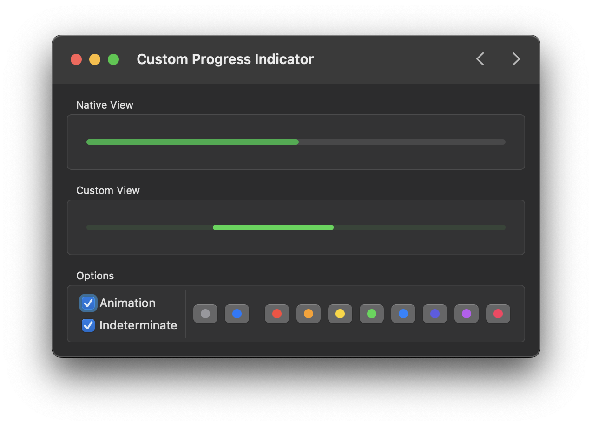

# SwiftUI Colorized Control Example

This repository provides an example implementation of using CoreImage filters with custom `NSViewRepresentable` implementations of macOS AppKit controls to achieve color-accurate control tint variations.

The `CIFilter` implemented is a color cube-type filter which wholesale overrides the lookup value of every color required to draw a control's layer. As color values are overriden to their exact specification, this approach is advantageous over using a hue rotation or other similar filter.

<i>A SwiftUI</i> <code>ProgressView</code> <i>and AppKit</i> <code>NSProgressIndicator</code> &mdash; <i>the first being adjusted via the</i> <code>.tint(:)</code> <i>modifier and the latter being adjusted via a custom</i> <code>CIFilter</code>.

## Say Hi

[Follow Stephan on Twitter](https://twitter.com/stephancasas)

## License

MIT
